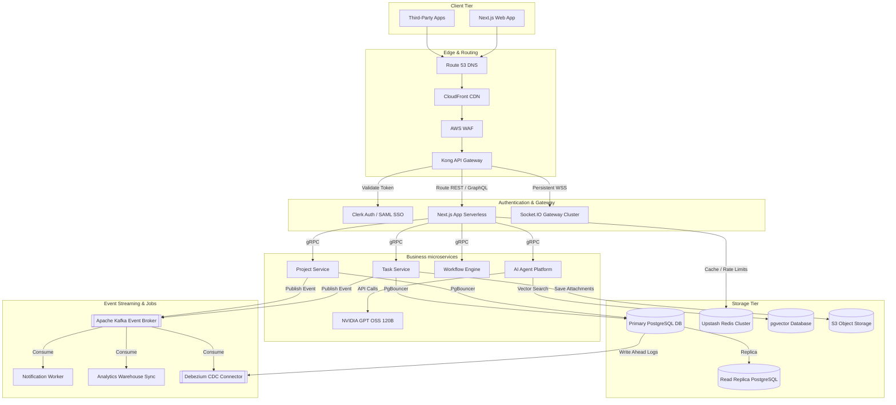
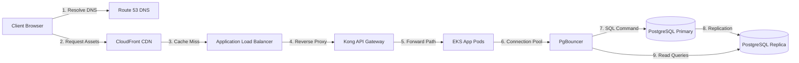
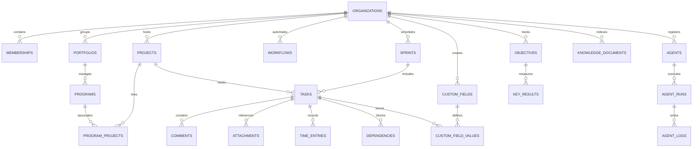
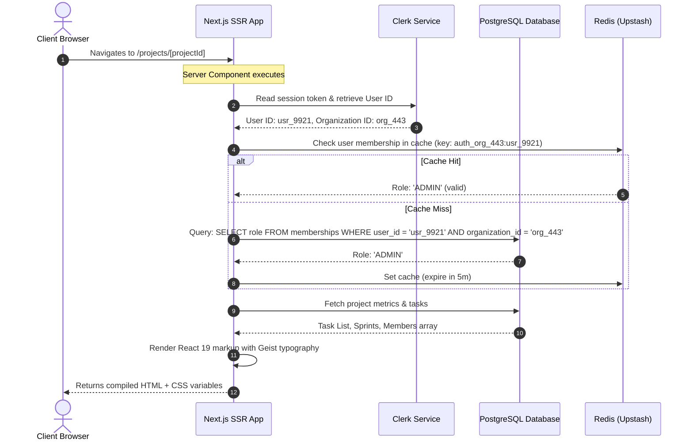
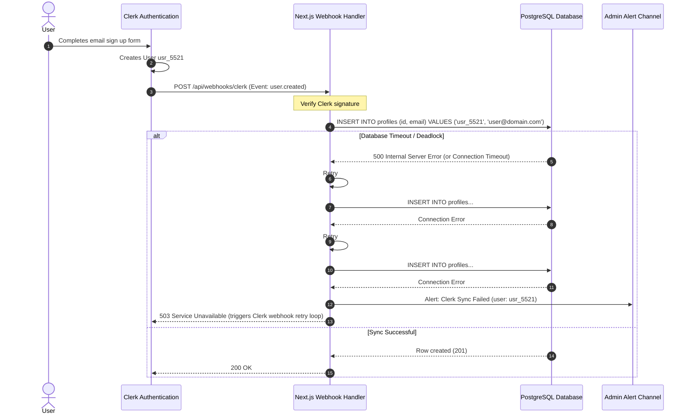
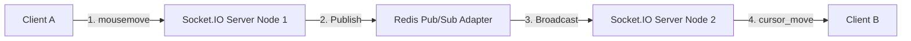
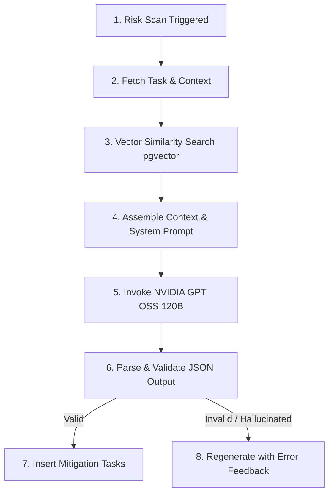
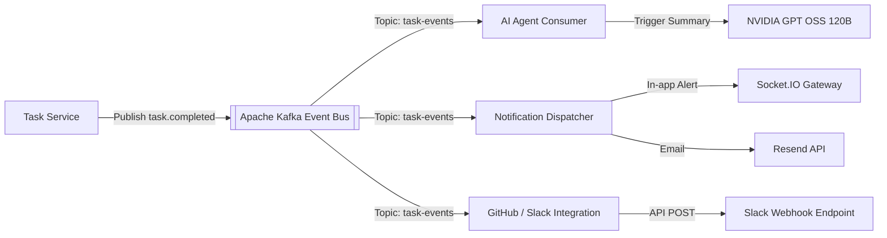
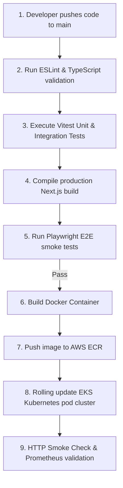

# ProjectForge: System Design Document (V1.0 - V4.0)

This document details the system design, data models, API specifications, and architectural evolution of **ProjectForge**, an Intelligent Work Operating System (OS). It maps the progression of the platform from a lightweight V1.0 project management MVP to an intelligent V5.0 enterprise-wide execution layer.

---

## 1. Requirements & Scope

### 1.1 Functional Requirements (By Evolution)

- **V1.0 - Core Collaboration MVP**:
  - Users can register, log in, and switch between multi-tenant **Organizations**.
  - Organization Owners and Admins can invite/remove users with basic role-based access control (`OWNER`, `ADMIN`, `MEMBER`).
  - Team members can create, update, and archive **Projects**, and manage **Tasks** (`TODO`, `IN_PROGRESS`, `DONE` statuses; `LOW` to `URGENT` priorities) with assignees, due dates, comments, and file attachments.
  - In-app notifications deliver updates when tasks are assigned or comments posted.
- **V2.0 - Work Management Platform**:
  - Teams can group tasks into time-boxed **Sprints** (`PLANNED`, `ACTIVE`, `COMPLETED`, `CANCELLED`).
  - Interactive **Kanban Board** supports drag-and-drop task card transitions.
  - System records project modifications in an **Activity Feed** and shows overdue task warnings.
  - Global search queries projects, tasks, members, and comments; users can save customized task filter views.
- **V3.0 - Execution Platform**:
  - Admins can construct **Workflow Automations** via Trigger-Condition-Action schemas.
  - Teams can configure custom status pipelines (e.g., Engineering: `Backlog` → `Ready` → `Dev` → `Testing` → `Done`).
  - Users can track efforts using manual logs and running timers (**Time Entries**).
  - Exposes a **Public API & Webhooks** platform for third-party systems (GitHub, GitLab, Slack).
- **V4.0 - Enterprise Operating System**:
  - Groups projects into **Portfolios** and coordinates them using **Programs**.
  - Introduces custom fields (`Story Points`, `Cost Center`) and advanced RBAC roles (Owner, Admin, Manager, Lead, Contributor, Viewer, Auditor).
  - Enforces compliance rules, audit trails, organizational hierarchies (departments), and Enterprise SSO.

### 1.2 Non-Functional Requirements (NFRs)

- **Latency**:
  - Page load and Dashboard load < 2.0s (p95).
  - UI state mutations (task creation, status change) < 500ms (p99).
  - Global text search response < 1.0s (p95); vector search response < 500ms.
- **Availability & Reliability**:
  - **V1-V2 (Monolith)**: 99.9% uptime.
  - **V3-V4 (Modular/Microservices)**: 99.95% uptime.
- **Consistency Model**:
  - **Strong Consistency (CP)**: Required for memberships, roles, permissions, time-tracking, custom fields, and strategic goals (OKRs) to prevent tenant leaks or compliance violations.
  - **Eventual Consistency (AP)**: Applied to activity feeds, notification delivery, dashboard metrics calculations, search index sync, and AI agent log streams.
- **Scalability Boundaries**:
  - **V1-V2 (MVP)**: Up to 1,000 organizations, 10,000 active users, and 100,000 tasks.
  - **V3-V4 (Enterprise)**: Up to 100,000 organizations, 1,000,000 active users, and 100,000,000 tas
- **Security & Compliance**:
  - Absolute multi-tenant logical isolation using Row-Level Security (RLS) in PostgreSQL.
  - Encryption in transit (TLS 1.3) and at rest (AES-256).
  - SOC 2 Type II compliance controls for data retention and auditability.

### 1.3 Out of Scope

- Direct billing transaction execution (delegated to Stripe API).
- Video/audio call conferencing streaming (only metadata stored).
- Native mobile app compilation configurations (web-first focus).

---

## 2. Back-of-the-Envelope Estimation

Estimation calculations below are modeled for the **Scale Milestone (100K DAU)**, illustrating the peak workloads of the V4/V5 architecture:

### 2.1 QPS Calculations

- **Assumptions**:
  - **DAU**: 100,000 users.
  - **Avg. Reads per User per Day**: 200 requests (includes navigating pages, loading boards, and auto-refresh events).
  - **Avg. Writes per User per Day**: 30 requests (creating/updating tasks, adding comments, logging times, and AI logs).
  - **Total Reads/Day**: $100,000 \times 200 = 20,000,000$ reads.
  - **Total Writes/Day**: $100,000 \times 30 = 3,000,000$ writes.
- **Average Read QPS**: $\frac{20,000,000 \text{ reads}}{86,400 \text{ seconds}} \approx 231.5 \text{ reads/sec}$
- **Average Write QPS**: $\frac{3,000,000 \text{ writes}}{86,400 \text{ seconds}} \approx 34.7 \text{ writes/sec}$
- **Peak Traffic Multiplier**: 5× (during morning login bursts or end-of-day reports).
- **Peak Read QPS**: $231.5 \times 5 = 1,157.5 \text{ requests/sec}$
- **Peak Write QPS**: $34.7 \times 5 = 173.5 \text{ requests/sec}$

### 2.2 Storage Growth Projections (Annual)

| Data Type                 | Avg. Record Size     | Daily New Records      | Daily Growth     | Annual Storage Growth |
| ------------------------- | -------------------- | ---------------------- | ---------------- | --------------------- |
| **Users / Profiles**      | 500 Bytes            | 500 (new signs)        | 250 KB           | 91.25 MB              |
| **Tasks & Custom Fields** | 2 KB                 | 50,000                 | 100 MB           | 36.5 GB               |
| **Comments (Markdown)**   | 1 KB                 | 100,000                | 100 MB           | 36.5 GB               |
| **Activity/Audit Logs**   | 500 Bytes            | 500,000                | 250 MB           | 91.25 GB              |
| **Task Attachments**      | 1 MB (compressed)    | 10,000 (uploads)       | 10 GB            | 3.65 TB               |
| **Vector Embeddings**     | 6.1 KB (1536 floats) | 150,000 (text changes) | 915 MB           | 333.9 GB              |
| **Total Database Data**   |                      |                        | **~1.26 GB/day** | **~498.24 GB/year**   |
| **Total Object Storage**  |                      |                        | **~10.0 GB/day** | **~3.65 TB/year**     |

### 2.3 Cache Sizing (80/20 Rule)

- **Goal**: Cache the hot dataset for active reads to relieve the primary database.
- **Daily Read Volume**: 20,000,000 transactions.
- **Hot Set (20%)**: 4,000,000 reads.
- **Average Object Size in Cache**: 2.5 KB (includes task payloads, projects meta, user profile structs).
- **Required RAM**: $4,000,000 \times 2.5 \text{ KB} = 10,000,000 \text{ KB} \approx 9.54 \text{ GB}$.
- **Multiplier for Overheads**: 1.5× (for session keys, indexes, and rate limiting buckets).
- **Recommended Redis Memory Size**: **16 GB** (configured as cluster or primary-replica pair).

### 2.4 Egress Bandwidth

- **API Payloads**: $231.5 \text{ read QPS} \times 15 \text{ KB (avg payload size)} = 3.47 \text{ MB/sec}$ (Peak: $17.3 \text{ MB/sec}$).
- **Media File Downloads**: $10,000 \text{ downloads/day} \times 1 \text{ MB} = 10 \text{ GB/day} \approx 115.7 \text{ KB/sec}$ (highly variable).
- **WebSockets (Presence/Cursors)**: $5,000 \text{ concurrent connections} \times 100 \text{ Bytes/packet} \times 5 \text{ packets/sec} \approx 2.5 \text{ MB/sec}$.

---

## 3. High-Level Architecture

The platform's topology evolves from a serverless Next.js monolith (V1-V3) into a decoupled event-driven microservices architecture (V4-V5) to support enterprise workloads and AI scaling.

### 3.1 System Topology (V5 Production)



### 3.2 Network & Infrastructure Pipeline



---

## 4. Data Model & Storage Design

### 4.1 Logical Entity-Relationship Diagram (ERD)



### 4.2 Database DDL (PostgreSQL Schema)

The DDL statements below define the physical schema for the core relational and vector elements, integrating check constraints, indexes, foreign keys, and updated_at triggers.

```sql
-- Enable necessary extensions
CREATE EXTENSION IF NOT EXISTS "uuid-ossp";
CREATE EXTENSION IF NOT EXISTS "pgcrypto";
CREATE EXTENSION IF NOT EXISTS "vector"; -- V5: pgvector extension

-- 1. Organizations
CREATE TABLE public.organizations (
    id UUID PRIMARY KEY DEFAULT gen_random_uuid(),
    name VARCHAR(100) NOT NULL,
    url_slug VARCHAR(50) NOT NULL UNIQUE,
    created_at TIMESTAMPTZ NOT NULL DEFAULT NOW(),
    updated_at TIMESTAMPTZ NOT NULL DEFAULT NOW(),
    CONSTRAINT chk_url_slug CHECK (url_slug ~ '^[a-z0-9-]+$')
);

-- 2. Profiles (Synced from Clerk OAuth metadata)
CREATE TABLE public.profiles (
    id VARCHAR(100) PRIMARY KEY, -- Maps to Clerk User ID
    full_name VARCHAR(150) NOT NULL,
    email VARCHAR(255) NOT NULL UNIQUE,
    avatar_url TEXT,
    created_at TIMESTAMPTZ NOT NULL DEFAULT NOW(),
    updated_at TIMESTAMPTZ NOT NULL DEFAULT NOW()
);

-- 3. Memberships
CREATE TABLE public.memberships (
    id UUID PRIMARY KEY DEFAULT gen_random_uuid(),
    user_id VARCHAR(100) NOT NULL REFERENCES public.profiles(id) ON DELETE CASCADE,
    organization_id UUID NOT NULL REFERENCES public.organizations(id) ON DELETE CASCADE,
    role VARCHAR(32) NOT NULL DEFAULT 'MEMBER'
        CHECK (role IN ('OWNER', 'ADMIN', 'MEMBER', 'MANAGER', 'LEAD', 'CONTRIBUTOR', 'VIEWER', 'AUDITOR')),
    created_at TIMESTAMPTZ NOT NULL DEFAULT NOW(),
    CONSTRAINT uq_user_org UNIQUE (user_id, organization_id)
);

-- 4. Projects
CREATE TABLE public.projects (
    id UUID PRIMARY KEY DEFAULT gen_random_uuid(),
    organization_id UUID NOT NULL REFERENCES public.organizations(id) ON DELETE CASCADE,
    name VARCHAR(150) NOT NULL,
    description TEXT,
    status VARCHAR(32) NOT NULL DEFAULT 'PLANNING'
        CHECK (status IN ('PLANNING', 'ACTIVE', 'COMPLETED', 'ARCHIVED')),
    created_at TIMESTAMPTZ NOT NULL DEFAULT NOW(),
    updated_at TIMESTAMPTZ NOT NULL DEFAULT NOW()
);

-- 5. Sprints
CREATE TABLE public.sprints (
    id UUID PRIMARY KEY DEFAULT gen_random_uuid(),
    organization_id UUID NOT NULL REFERENCES public.organizations(id) ON DELETE CASCADE,
    name VARCHAR(100) NOT NULL,
    goal TEXT,
    start_date TIMESTAMPTZ NOT NULL,
    end_date TIMESTAMPTZ NOT NULL,
    status VARCHAR(32) NOT NULL DEFAULT 'PLANNED'
        CHECK (status IN ('PLANNED', 'ACTIVE', 'COMPLETED', 'CANCELLED')),
    created_at TIMESTAMPTZ NOT NULL DEFAULT NOW(),
    CONSTRAINT chk_dates CHECK (start_date < end_date)
);

-- 6. Tasks
CREATE TABLE public.tasks (
    id UUID PRIMARY KEY DEFAULT gen_random_uuid(),
    project_id UUID NOT NULL REFERENCES public.projects(id) ON DELETE CASCADE,
    organization_id UUID NOT NULL REFERENCES public.organizations(id) ON DELETE CASCADE,
    sprint_id UUID REFERENCES public.sprints(id) ON DELETE SET NULL,
    title VARCHAR(255) NOT NULL,
    description TEXT,
    status VARCHAR(32) NOT NULL DEFAULT 'TODO'
        CHECK (status IN ('TODO', 'IN_PROGRESS', 'DONE')),
    priority VARCHAR(32) NOT NULL DEFAULT 'MEDIUM'
        CHECK (priority IN ('LOW', 'MEDIUM', 'HIGH', 'URGENT')),
    assignee_id VARCHAR(100) REFERENCES public.profiles(id) ON DELETE SET NULL,
    due_date TIMESTAMPTZ,
    created_at TIMESTAMPTZ NOT NULL DEFAULT NOW(),
    updated_at TIMESTAMPTZ NOT NULL DEFAULT NOW()
);

-- 7. Task Label definitions
CREATE TABLE public.task_labels (
    id UUID PRIMARY KEY DEFAULT gen_random_uuid(),
    organization_id UUID NOT NULL REFERENCES public.organizations(id) ON DELETE CASCADE,
    name VARCHAR(50) NOT NULL,
    color VARCHAR(10) NOT NULL, -- Hex format e.g., #FF5733
    created_at TIMESTAMPTZ NOT NULL DEFAULT NOW(),
    CONSTRAINT uq_org_label_name UNIQUE (organization_id, name)
);

-- 8. Task Label Mappings
CREATE TABLE public.task_label_mappings (
    task_id UUID NOT NULL REFERENCES public.tasks(id) ON DELETE CASCADE,
    label_id UUID NOT NULL REFERENCES public.task_labels(id) ON DELETE CASCADE,
    PRIMARY KEY (task_id, label_id)
);

-- 9. Knowledge Documents
CREATE TABLE public.knowledge_documents (
    id UUID PRIMARY KEY DEFAULT gen_random_uuid(),
    organization_id UUID NOT NULL REFERENCES public.organizations(id) ON DELETE CASCADE,
    title VARCHAR(255) NOT NULL,
    content TEXT NOT NULL,
    doc_type VARCHAR(32) NOT NULL CHECK (doc_type IN ('policy', 'retro', 'decision', 'notes')),
    created_at TIMESTAMPTZ NOT NULL DEFAULT NOW(),
    updated_at TIMESTAMPTZ NOT NULL DEFAULT NOW()
);

-- 10. Vector Embeddings Table (V5: pgvector store)
CREATE TABLE public.embeddings (
    id UUID PRIMARY KEY DEFAULT gen_random_uuid(),
    organization_id UUID NOT NULL REFERENCES public.organizations(id) ON DELETE CASCADE,
    entity_type VARCHAR(50) NOT NULL CHECK (entity_type IN ('task', 'knowledge_documents', 'comments')),
    entity_id UUID NOT NULL,
    embedding vector(1536) NOT NULL, -- 1536-dimensional vectors for OpenAI / Gemini models
    created_at TIMESTAMPTZ NOT NULL DEFAULT NOW()
);

-- Create updated_at trigger helper
CREATE OR REPLACE FUNCTION public.update_modified_column()
RETURNS TRIGGER AS $$
BEGIN
    NEW.updated_at = NOW();
    RETURN NEW;
END;
$$ LANGUAGE plpgsql;

-- Set triggers on updated_at columns
CREATE TRIGGER set_orgs_updated_at BEFORE UPDATE ON public.organizations FOR EACH ROW EXECUTE FUNCTION public.update_modified_column();
CREATE TRIGGER set_profiles_updated_at BEFORE UPDATE ON public.profiles FOR EACH ROW EXECUTE FUNCTION public.update_modified_column();
CREATE TRIGGER set_projects_updated_at BEFORE UPDATE ON public.projects FOR EACH ROW EXECUTE FUNCTION public.update_modified_column();
CREATE TRIGGER set_tasks_updated_at BEFORE UPDATE ON public.tasks FOR EACH ROW EXECUTE FUNCTION public.update_modified_column();
CREATE TRIGGER set_knowledge_docs_updated_at BEFORE UPDATE ON public.knowledge_documents FOR EACH ROW EXECUTE FUNCTION public.update_modified_column();
```

### 4.3 Database Indexing Strategy

To maintain sub-second latency targets at scale (100M+ tasks), indexes are defined to support multi-tenant query patterns and vector similarity:

| Target Table  | Index Name                 | Columns Covered              | Index Type | Rationale                                             |
| ------------- | -------------------------- | ---------------------------- | ---------- | ----------------------------------------------------- |
| `memberships` | `idx_memberships_user_org` | `(user_id, organization_id)` | B-Tree     | Resolves user permission verification sweeps.         |
| `projects`    | `idx_projects_org`         | `(organization_id)`          | B-Tree     | Isolates project fetching by tenant boundaries.       |
| `tasks`       | `idx_tasks_project_status` | `(project_id, status)`       | B-Tree     | Powers dashboard task listings and Kanban views.      |
| `tasks`       | `idx_tasks_assignee`       | `(assignee_id)`              | B-Tree     | Optimizes "My Tasks" query paths.                     |
| `tasks`       | `idx_tasks_due_date`       | `(due_date DESC)`            | B-Tree     | Accelerates "Overdue Tasks" batch sweeps.             |
| `embeddings`  | `idx_embeddings_cosine`    | `(embedding)`                | HNSW       | Speeds up cosine distance vector search (`pgvector`). |
| `embeddings`  | `idx_embeddings_entity`    | `(entity_type, entity_id)`   | B-Tree     | Links embeddings back to parent entities.             |

### 4.4 Data Retention & Archival Policies

- **Audit & Activity Logs**: Kept in the primary PostgreSQL database for 90 days. Shipped to S3 Glacier daily via a CDC pipeline. Retained on Glacier for 7 years for enterprise SOC 2 compliance.
- **Archived Projects & Tasks**: Retained inline in SQL tables with `status = 'ARCHIVED'` to prevent breaking user history. A batch job moves tasks from projects archived > 2 years into cold-storage parquet files in S3.
- **Deleted File Attachments**: Retained in S3 bucket's `.trash/` directory for 30 days before permanent deletion.

---

## 5. API & Communication Patterns

### 5.1 Communication Protocols Selection

- **REST APIs**: Used for all standard CRUD requests (user registration, projects creation, billing updates, profile configurations) where client-server operations are synchronous and simple.
- **gRPC (Internal)**: Utilized for high-performance communication between internal microservices (e.g., Task Service calling Workflow Engine or Auth validation) to enforce strict contracts and minimize network overhead.
- **WebSockets (via Socket.IO)**: Used for persistent bidirectional streaming of collaborative elements, including Kanban card drag-and-drop notifications, user presence lists, and live collaborative cursor movements.
- **HTTP webhooks**: Distributed outbound HTTP POST triggers notifying registered third-party systems of workspace state mutations (e.g., trigger Slack action on `task.completed`).

### 5.2 REST API Endpoint Specifications

All endpoints require authentication (Bearer JWT token) and return RFC 7807 problem details error structures in case of failure.

| Method    | Path                  | Auth Required | Rate Limit | Idempotency Required | Description                                          |
| --------- | --------------------- | ------------- | ---------- | -------------------- | ---------------------------------------------------- |
| **GET**   | `/v1/orgs`            | Yes           | 100/min    | No                   | Returns list of organizations the user belongs to.   |
| **POST**  | `/v1/orgs`            | Yes           | 10/min     | Yes                  | Creates a new organization workspace.                |
| **GET**   | `/v1/projects`        | Yes           | 200/min    | No                   | Fetches paginated projects for active organization.  |
| **POST**  | `/v1/projects`        | Yes           | 30/min     | Yes                  | Creates a new project in the active organization.    |
| **GET**   | `/v1/tasks/:id`       | Yes           | 500/min    | No                   | Returns detailed task JSON (with comments & labels). |
| **PATCH** | `/v1/tasks/:id`       | Yes           | 200/min    | No                   | Updates task fields (status, assignee, priority).    |
| **POST**  | `/v1/workflows`       | Yes (Admin)   | 20/min     | Yes                  | Saves a new trigger-condition-action rule.           |
| **POST**  | `/v1/search/semantic` | Yes           | 50/min     | No                   | Queries pgvector database using semantic search.     |

### 5.3 RFC 7807 Error Schema Example

```json
{
  "type": "https://api.projectforge.com/errors/insufficient-permissions",
  "title": "Forbidden Action",
  "status": 403,
  "detail": "Members with the 'CONTRIBUTOR' role are not permitted to update project metadata. Contact your organization administrator.",
  "instance": "/v1/projects/550e8400-e29b-41d4-a716-446655440000"
}
```

---

## 6. Data Flow Examples

### 6.1 Happy Path: Dynamic Page Load & SSR Membership Check

This diagram details the server-side rendering path when a team member navigates to a project details dashboard.



### 6.2 Failure Flow: Clerk User Signup Webhook Sync Failure

This flow tracks the self-healing and alerting loop when a user registers on Clerk but the PostgreSQL webhook fails to sync.



### 6.3 Async Process: Sprint Completion & Overdue Task Rollover

Tracks the background task executed when a Sprint ends, rolling incomplete tasks into the next Sprint.

```mermaid
sequenceDiagram
    autonumber
    participant Scheduler as Cron Trigger (Inngest)
    participant Worker as Background Job Consumer
    participant DB as PostgreSQL Database
    participant WSS as Socket.IO Server
    participant Email as Resend API

    Scheduler->>Worker: Trigger Job: end_sprint_rollover {sprint_id: spr_112}
    Worker->>DB: UPDATE sprints SET status = 'COMPLETED' WHERE id = 'spr_112'
    Worker->>DB: Query: SELECT id FROM tasks WHERE sprint_id = 'spr_112' AND status != 'DONE'
    DB-->>Worker: List of 3 incomplete tasks
    Worker->>DB: Query: SELECT id FROM sprints WHERE organization_id = org_123 AND status = 'PLANNED' LIMIT 1
    DB-->>Worker: Next Sprint ID: spr_113
    Worker->>DB: UPDATE tasks SET sprint_id = 'spr_113' WHERE id IN (incomplete_tasks)
    Worker->>DB: INSERT INTO activity_feed (action_type, details) values ('sprint.rollover', ...)
    Worker->>WSS: Broadcast event: 'tasks.updated' {sprint_id: spr_113}
    WSS-->>actor Users: Live updates update Kanban columns on board
    Worker->>Email: Send summary notification to Project Manager
```

---

## 7. Critical Components Deep Dive

### 7.1 Real-Time Collaborative Cursor and Board Presence

ProjectForge's whiteboard feel requires streaming client cursor coordinates and active board collaborators with low latency.

- **Technology**: Built using a cluster of Socket.IO servers backed by Upstash Redis Adapter for pub/sub message routing between nodes.
- **Optimization**:
  - **Payload Minimization**: Cursor events do not contain names or project data, only `x, y` floats, user ID, and color code.
  - **Throttling**: Client mousemove events are throttled to **50ms intervals** using standard lodash/debounce variations, reducing packet generation per user from 60/sec to 20/sec.
  - **Room Isolation**: Socket rooms are divided by dynamic project paths: `project:presence:${projectId}`.



### 7.2 AI Multi-Agent Orchestration & NVIDIA GPT OSS 120B Integration

The V5 execution layer uses specialized agents to manage planning, write code, and detect project delivery risks.

- **Core Pipeline**:
  - **Prompt Context builder**: Combines task metadata, related comments, and adjacent node data fetched from the **Knowledge Graph** (stored in PostgreSQL).
  - **Embedding Retrieval**: Performs a cosine similarity lookup against the `embeddings` table (using `pgvector` operators `<=>`) to inject relevant historical project retrospectives into the model prompt.
  - **Structured Execution**: Sends the query to the local OpenAI-compatible API endpoint hosting **NVIDIA GPT OSS 120B**. The model returns structured JSON containing task breakdowns or risk mitigation strategies.
  - **Agent Execution Guardrails**: Runs all agent actions inside a sandbox executor. Failures are written to `agent_logs` table, and rate limiters restrict agent executions to a maximum of 5 runs/hour per user to control GPU costs.



### 7.3 Idempotency and Race Conditions on Kanban Drag-and-Drop

When multiple users drag task cards on the Kanban board simultaneously, race conditions can cause data loss or incorrect status updates.

- **Mitigation**:
  - **Optimistic Updates**: The client updates the local board state instantly to maintain responsiveness, showing a subtle dotted outline indicating database sync progress.
  - **Version Checks**: The API payload contains the expected previous task state and an `updated_at` timestamp.
  - **Database Locks**: The Server Action executes the write inside a PostgreSQL transaction using a row lock:
    ```sql
    -- Lock task row to prevent concurrent updates
    SELECT updated_at FROM tasks WHERE id = $1 FOR UPDATE;
    ```
    If the database `updated_at` value is newer than the client payload, the action rejects the write, and the Socket.IO server pushes a reconciliation event to revert the client board state.

---

## 8. Event-Driven & Integration Patterns

As ProjectForge grows to V3+, synchronous execution patterns are replaced by an asynchronous event architecture.

### 8.1 Event-Driven Flow (V4/V5 Pipeline)



### 8.2 Event Sourcing & CQRS (V4/V5 Analytics)

- **Write Path (Command)**: Modifications to critical entities (tasks, memberships) are logged as immutable event journals in the database.
- **Read Path (Query)**: Read operations querying status metrics bypass transaction tables and fetch pre-aggregated dashboard projections from Redis, synced in real-time via Kafka consumers.
- **Change Data Capture (CDC)**: A Debezium connector monitors the PostgreSQL write-ahead log (WAL) and streams changes to an Elasticsearch cluster for full-text search indexing, ensuring search updates in < 1 second.

---

## 9. Trade-offs & Architecture Decision Records (ADRs)

### ADR-001: Clerk Auth & Profile Sync Strategy

- **Status**: Accepted
- **Context**: ProjectForge requires user authentication and profile management. Clerk is selected for authentication, but project collaboration metadata (assigning tasks, indexing users) requires storing profiles in the local PostgreSQL database.
- **Options Considered**:
  - **Option A**: Query Clerk API directly on every request.
  - **Option B**: Sync user data locally using Clerk Webhooks on registration.
  - **Option C**: Implement custom JWT cookie-based session database.

| Model Variable       | Option A (Direct API)     | Option B (Webhook Sync)      | Option C (Custom Session) |
| -------------------- | ------------------------- | ---------------------------- | ------------------------- |
| **Complexity**       | Low                       | Medium                       | High                      |
| **Performance**      | Poor (adds 200ms API hop) | High (local SQL query)       | High                      |
| **Reliability**      | Dependent on Clerk SLA    | Self-healing (Clerk retries) | Full Control              |
| **Development Cost** | $0                        | $0 (webhook config)          | High (maintain code)      |

- **Decision**: Adopt **Option B (Webhook Sync)**. We configure a Clerk webhook handler at `/api/webhooks/clerk` that synchronizes profile details into a local `profiles` table on `user.created` and `user.updated` events.
- **Consequences**:
  - _Enables_: Fast local database joins between profiles, memberships, and tasks.
  - _Accepts_: Eventual consistency window (typically < 2 seconds) on new user registrations.
  - _Requires_: Webhook signature verification and failure retry logging.

---

### ADR-002: Vector Search Database Selection for Knowledge Graph

- **Status**: Accepted
- **Context**: V5 requires vector embedding storage (1536 dimensions) for semantic searches and AI agent retrieval.
- **Options Considered**:
  - **Option A**: Dedicated Vector Database (Pinecone / Milvus).
  - **Option B**: PostgreSQL using `pgvector` extension.

| Model Variable             | Option A (Dedicated Store)     | Option B (pgvector)             |
| -------------------------- | ------------------------------ | ------------------------------- |
| **Operational Complexity** | High (managing 2 databases)    | Low (single DB instance)        |
| **Multi-Tenant Isolation** | Complex (partition namespaces) | Simple (SQL RLS rules apply)    |
| **Cost**                   | High ($100+/month base)        | Low (included in RDS footprint) |
| **Scale Limit**            | Billions of vectors            | ~100M vectors                   |

- **Decision**: Adopt **Option B (pgvector)**. Storing embeddings in a native PostgreSQL table simplifies transactional consistency and allows us to enforce multi-tenant Row-Level Security (RLS) automatically.
- **Consequences**:
  - _Enables_: Seamless transactional writes, zero dual-write synchronization overhead, and automatic RLS enforcement.
  - _Accepts_: Vertical CPU constraints at extreme scale; will require HNSW index tuning.

---

### ADR-003: Architectural Transition from Next.js Monolith to Microservices

- **Status**: Accepted
- **Context**: V1-V3 is a Next.js monolith using Server Actions. Moving to V4/V5 introduces portfolios, integrations, and high-volume background jobs that can cause resource starvation.
- **Options Considered**:
  - **Option A**: Remain on Next.js monolithic serverless architecture.
  - **Option B**: Migrate to a distributed microservices architecture.

| Model Variable           | Option A (Next.js Monolith)          | Option B (Microservices on Kubernetes) |
| ------------------------ | ------------------------------------ | -------------------------------------- |
| **Development Velocity** | High (single repository)             | Low (managing service boundaries)      |
| **Scalability**          | Resource contention on DB            | Scalable service-level scaling         |
| **Operational Burden**   | Low (managed on Vercel)              | High (managing EKS and Kong)           |
| **Fail-safe Boundaries** | Low (auth failure can take down app) | High (isolated process failures)       |

- **Decision**: Adopt **Option B (Distributed Services)** during the Phase 4 roadmap. We decompose critical services (Tasks, Auth, AI, Workflows) into containerized Go/Node.js services on Kubernetes, while Next.js remains as the frontend host.
- **Consequences**:
  - _Enables_: Clean scale boundaries, independent database replication, and isolated agent execution runtimes.
  - _Requires_: API Gateway setup, service-to-service gRPC contracts, and distributed telemetry.

---

## 10. Scalability & Performance Optimization

### 10.1 Database Query Optimization

- **EXPLAIN ANALYZE**: All critical write and search queries must be evaluated using `EXPLAIN (ANALYZE, BUFFERS)` to verify index usage and eliminate sequential scans on tables exceeding 10,000 rows.
- **Partial Indexes**: To accelerate active sprints listings, we use partial indexes filtering completed rows:
  ```sql
  CREATE INDEX idx_active_tasks ON tasks (organization_id) WHERE status != 'DONE';
  ```

### 10.2 Caching Strategy

- **L1 Cache (Client UI)**: Managed via Zustand for interface states and TanStack Query for server state caching. TanStack Query uses a default `staleTime` of 5 seconds for live lists, reducing duplicate fetches during user navigation.
- **L2 Cache (Distributed)**: Hosted on Upstash Redis. Stores organization membership configurations, permission mappings, and dashboard analytics metrics.
- **Cache Stampede Prevention**: Using singleflight execution wrappers in the API gateway so concurrent dashboard requests coalesce into a single backend database query on cache misses.

---

## 11. Resilience & Disaster Recovery

### 11.1 Failure Mode Analysis

| Component / Dependency    | Failure Behavior      | System Action & Fallback                                                                                             |
| ------------------------- | --------------------- | -------------------------------------------------------------------------------------------------------------------- |
| **Primary Database (PG)** | Complete outage       | Block write transactions; failover to read replica. App functions in read-only mode, showing a maintenance banner.   |
| **Clerk Auth Service**    | API Timeout / Outage  | Users cannot login. Active sessions with valid JWTs continue to browse cached data for up to 1 hour.                 |
| **Upstash Redis (Cache)** | Cache instance crash  | System falls back to direct database reads. Rate limit checking switches to in-memory counters in API gateway nodes. |
| **NVIDIA GPU Endpoint**   | GPU model unavailable | AI Agent operations are queued in Kafka. The UI shows an "Agent busy - processing task" loader with backoff retries. |

### 11.2 Retry Policies & Circuit Breakers

All external API connections (Clerk, Resend, NVIDIA API, Webhook endpoints) are wrapped in circuit breakers with exponential backoff and jitter:

$$T = \min\left(T_{\text{max}},\ T_{\text{base}} \times 2^{\text{attempt}}\right) \pm \text{random\_jitter}$$

- $T_{\text{base}} = 500\text{ms}$
- $T_{\text{max}} = 10\text{sec}$
- **Max Attempts**: 3. If retries fail, the circuit breaker opens for 30 seconds, routing calls to a fallback queue or returning a graceful 503 error.

### 11.3 Backup, RTO, and RPO Targets

- **Backup Pipeline**: Daily automated database snapshots. WAL archiving every 15 minutes to multi-region S3 buckets.
- **RTO (Recovery Time Objective)**: < 15 minutes (target for database failover and routing restoration).
- **RPO (Recovery Point Objective)**: < 15 minutes (maximum acceptable data loss window, matching WAL replication frequency).

---

## 12. Security & Threat Modeling

### 12.1 OWASP Top 10 Threat Mitigation Matrix

| Threat                           | Risk     | Attack Surface              | Mitigation                                                                                                    | Status   |
| -------------------------------- | -------- | --------------------------- | ------------------------------------------------------------------------------------------------------------- | -------- |
| **A01: Broken Access Control**   | Critical | API endpoints, task drawers | PostgreSQL Row-Level Security (RLS) + organization member check interceptors on all actions.                  | Enforced |
| **A02: Cryptographic Failures**  | High     | Data in transit/at rest     | Enforce TLS 1.3 for API traffic. AWS KMS encryption keys for S3 buckets and EBS databases.                    | Enforced |
| **A03: Injection**               | Critical | Forms, search queries       | Enforce parameterized SQL queries via ORM/Query builders. Schema-level validation using Zod.                  | Enforced |
| **A07: Identification Failures** | Critical | JWT session management      | Offload authentication to Clerk. Force token validation and rotation policies.                                | Enforced |
| **A10: SSRF**                    | Medium   | Outbound webhooks           | Route all outbound webhook requests through isolated proxy servers (e.g., Squid) restricting destination IPs. | Planned  |

### 12.2 Multi-Tenant Database Isolation using PostgreSQL RLS

We enforce data isolation using Row-Level Security (RLS) in PostgreSQL. Each tenant query must specify the user's authenticated context.

```sql
-- Enable RLS on core tables
ALTER TABLE public.projects ENABLE ROW LEVEL SECURITY;
ALTER TABLE public.tasks ENABLE ROW LEVEL SECURITY;

-- Create policy for projects: User can access projects if they are a member of the project's organization
CREATE POLICY project_access_policy ON public.projects
    FOR ALL
    USING (
        organization_id IN (
            SELECT organization_id
            FROM public.memberships
            WHERE user_id = current_setting('app.current_user_id', true)
        )
    );

-- Create policy for tasks: User can access tasks through their organization membership
CREATE POLICY task_access_policy ON public.tasks
    FOR ALL
    USING (
        organization_id IN (
            SELECT organization_id
            FROM public.memberships
            WHERE user_id = current_setting('app.current_user_id', true)
        )
    );
```

To invoke queries safely inside Next.js Server Actions, the database connection config sets the session variable before executing commands:

```typescript
const insforge = await createInsforgeServer();
// Set current authenticated user context inside the session transaction
await insforge.rpc("set_current_user", { user_id: session.userId });
const { data, error } = await insforge.from("tasks").select("*").eq("project_id", projectId);
```

---

## 13. Observability & DevOps

### 13.1 SLI/SLO Target Definitions

| SLI Name                           | Measurement Method                                                                 | SLO Target                   | Alerting Threshold               |
| ---------------------------------- | ---------------------------------------------------------------------------------- | ---------------------------- | -------------------------------- |
| **API Availability**               | $\frac{\text{Successful Requests (HTTP 2xx/3xx)}}{\text{Total Requests received}}$ | **$\ge 99.95\%$**            | $< 99.9\%$ over 5 minutes        |
| **Task Status Transition Latency** | Duration of task update Server Action execution                                    | **$\le 500\text{ms}$ (p99)** | $> 800\text{ms}$ over 10 minutes |
| **Notification Lag**               | Delay between action trigger and in-app display                                    | **$\le 1.0\text{s}$ (p95)**  | $> 5.0\text{s}$ over 5 minutes   |
| **Error Rate**                     | $\frac{\text{Server Errors (HTTP 5xx)}}{\text{Total Requests}}$                    | **$\le 0.05\%$**             | $> 0.1\%$ over 5 minutes         |

### 13.2 Observability Architecture (Pillars)

- **Structured Logs**: Application servers write JSON logs via Pino, carrying trace context (`trace_id`, `span_id`, `org_id`, `user_id`).
- **Metrics Ingestion**: Prometheus pulls server performance statistics (CPU utilization, database connections pool saturation, Redis cache hit rates) and displays dashboards on Grafana.
- **Distributed Tracing**: Enforced across services using **OpenTelemetry**. Traces are generated at the Next.js API Gateway, carried through gRPC calls, and terminated at database transaction execution blocks.

### 13.3 CI/CD Deployment Pipeline



---

## 14. Testing Architecture

ProjectForge maintains quality control using automated validations at each stage of the delivery pipeline.

```
       ▲
      / \
     /   \       End-to-End Tests (Playwright) - Critical Journeys
    / E2E \      Frequency: Nightly / Pre-deploy
   /-------\
  /  Cont.  \    Contract Tests (Pact) - Service Interfaces
 /-----------\
/ Integration \  Integration Tests (Vitest + pg-testcontainers) - DB Queries & Server Actions
/-------------\
/    Unit     \  Unit Tests (Vitest) - Business Logic, Utility functions, Validations
/--------------\
```

### 14.1 Test Suite Breakdown

- **Unit Tests**: Focus on schema validation, custom status validations, and helper utilities. Target: **$\ge 80\%$ code coverage**.
- **Integration Tests**: Set up isolated PostgreSQL instances inside Docker using testcontainers. Validate query indexes, database schema triggers, and role-based permissions checking.
- **E2E Smoke Test**: Simulates a complete user journey using Playwright browser automation:
  1. Creates User A -> Sets up organization workspace.
  2. Invites User B -> Switch user context.
  3. Creates project -> Creates task -> Assigns task.
  4. Changes task status -> Posts comment -> Validates dashboard metrics increment.
- **Load Testing**: Pre-release load scripts executed via **k6** simulating peak workloads (1,157 read QPS, 173 write QPS) to verify that database connection pools and Redis instances do not exhaust resources.

---

## 15. Cost Estimation

The projections below model cloud infrastructure costs under sequential growth phases using AWS services.

### 15.1 Monthly Cloud Cost Breakdown (100K DAU Scale)

| AWS Resource Service    | Tier / Instance Size                         | Unit Cost      | Count       | Monthly Footprint Cost |
| ----------------------- | -------------------------------------------- | -------------- | ----------- | ---------------------- |
| **API / Compute Tier**  | ECS Fargate containers (2 vCPU, 4 GB)        | \$0.04/hr      | 12          | \$345.60               |
| **Primary Database**    | RDS PostgreSQL db.r6g.xlarge (4 vCPU, 32 GB) | \$0.52/hr      | 1 (Active)  | \$379.60               |
| **Read Replica**        | RDS PostgreSQL db.r6g.xlarge                 | \$0.52/hr      | 1 (Passive) | \$379.60               |
| **Cache Cluster**       | Upstash Redis Enterprise (16 GB memory)      | flat scale     | —           | \$180.00               |
| **Object Storage**      | S3 Standard (1 TB storage + egress actions)  | \$0.023/GB     | 1,000 GB    | \$35.00                |
| **CDN & Security Edge** | CloudFront Edge + WAF policies               | flat + traffic | —           | \$220.00               |
| **Email Delivery**      | Resend Pro Plan                              | flat scale     | —           | \$89.00                |
| **AI GPU Endpoint**     | NVIDIA Host Node (GPU rental)                | flat           | —           | \$850.00               |
| **Monitoring Hub**      | Datadog Core + OpenTelemetry ingestion       | flat           | 10 hosts    | \$230.00               |
| **Total Monthly Cost**  |                                              |                |             | **~\$2,708.80**        |

### 15.2 Milestone Projections

```
  Monthly Cost ($)
   12,000 ┼─────────────────────────────────────────────────────────────── 1M DAU ($11,850)
          │
   10,000 ┼
          │
    8,000 ┼
          │
    6,000 ┼
          │
    4,000 ┼
          │
    2,000 ┼                                           100K DAU ($2,709)
          │                    10K DAU ($790)
        0 ┼─── 1K DAU ($180) ───────────────────────────────────────────
          └────┴───────────────┴──────────────────────┴──────────────────
              1K              10K                    100K                1M     (DAU Scale)
```

- **1K DAU Milestone**: **\$180/month**. Single Next.js node, serverless RDS Postgres, free-tier email and caching.
- **10K DAU Milestone**: **\$790/month**. 2 compute nodes, multi-AZ database, basic Redis node, and early AI GPU workloads.
- **100K DAU Milestone**: **\$2,709/month**. Containerized EKS cluster, dedicated primary-replica PostgreSQL, Upstash Redis, and hosting local AI endpoints.
- **1M DAU Milestone**: **\$11,850/month**. Auto-scaling Kubernetes nodes, sharded PostgreSQL tables, global Redis cluster, dedicated Kafka cluster, and GPU server clusters.

---

## 16. Evolution Roadmap & Pre-flight Checklist

### 16.1 Zero-Downtime Database Schema Migration (Expand-Contract Pattern)

To execute database schema migrations without service downtime, we enforce the **Expand-Contract Pattern**. Below is the sequence for renaming a column (e.g., renaming `due_date` to `due_timestamp` in `tasks`):

```
       [Phase 1: Expand]                     [Phase 2: Migrate]                    [Phase 3: Contract]
┌──────────────────────────────┐     ┌──────────────────────────────┐     ┌──────────────────────────────┐
│ 1. Add "due_timestamp"       │     │ 1. Execute backfill script   │     │ 1. Deploy app code that      │
│    column in database        │     │    copying due_date values   │     │    reads/writes ONLY to      │
│ 2. Deploy app code that      │     │    to due_timestamp column   │     │    due_timestamp column      │
│    writes to BOTH columns    │     │ 2. Run in batches of 1,000   │     │ 2. Add NOT NULL constraint   │
│ 3. App reads from due_date   │     │    rows to avoid row locks   │     │ 3. Drop "due_date" column    │
└──────────────────────────────┘     └──────────────────────────────┘     └──────────────────────────────┘
```

#### Backfill Batch Migration Script Example

```sql
-- Run in small transactional chunks to prevent catalog locking on large tables
DO $$
DECLARE
    rows_updated INT;
    batch_limit INT := 1000;
BEGIN
    LOOP
        UPDATE public.tasks
        SET due_timestamp = due_date
        WHERE due_timestamp IS NULL
          AND due_date IS NOT NULL
          AND id IN (
              SELECT id
              FROM public.tasks
              WHERE due_timestamp IS NULL
                AND due_date IS NOT NULL
              LIMIT batch_limit
          );

        GET DIAGNOSTICS rows_updated = ROW_COUNT;
        COMMIT; -- Commit the batch transaction

        EXIT WHEN rows_updated = 0;
        PERFORM pg_sleep(0.1); -- Sleep to allow other transactions to execute
    END LOOP;
END $$;
```

### 16.2 Pre-Flight Launch Checklist

Before launching any new version features, engineers must verify the following checkpoints:

- [ ] **Data Consistency**: Define explicit consistency models (strong vs eventual) for all new data paths. Verify rate-limiters are set on all write actions.
- [ ] **Multi-Tenant Isolation**: Ensure every query on the new table references the user's active `organization_id` context. Verify RLS policies are enabled.
- [ ] **Dependencies Boundaries**: Ensure no circular imports between code folders (e.g., components must not import directly from server actions; agent code has zero imports from frontend UI).
- [ ] **Resilience Guardrails**: Verify all external API calls are wrapped in circuit breakers with exponential backoff and jitter configurations.
- [ ] **Query Execution Checks**: Run `EXPLAIN ANALYZE` on all new query paths to confirm B-Tree/GIN index coverage.
- [ ] **Telemetry Ingestion**: Ensure new routes are instrumented with structured JSON logs, trace IDs, and custom event markers in Prometheus.
- [ ] **Migration Scripts**: Test migration rollback scripts on staging environments using copy datasets of production data.
- [ ] **Load Capacity Checks**: Verify the target infrastructure (EC2 nodes, Redis clusters, pgBouncer limits) matches peak QPS requirements.
